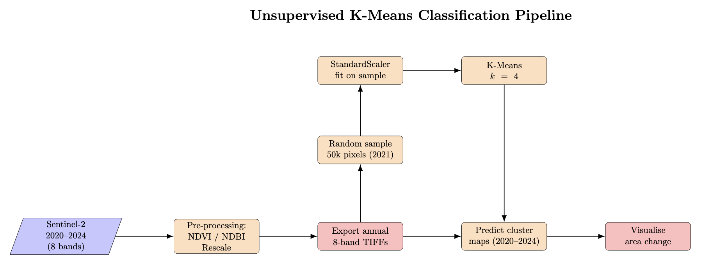

# Evaluating Supervised and Unsupervised Land-Cover Classification in Urban Environments  
### A Sentinel-2 Case Study of Waltham Forest, London (2020–2024)

This repository compares a classical unsupervised K-means workflow with a supervised Random-Forest model for yearly land-cover mapping over Waltham Forest.  
The study assesses accuracy, temporal consistency and carbon footprint, demonstrating how choice of algorithm affects both performance and sustainability.

---

<strong>Table of Contents</strong>

1. [Project motivation and background](#project-motivation-and-background)  
2. [Data source and preprocessing](#data-source-and-preprocessing)  
3. [Method overview](#method-overview)  
   * [Unsupervised K-means pipeline](#unsupervised-k-means-notebook-2)  
   * [Supervised Random-Forest pipeline](#supervised-random-forest-notebook-3)  
4. [Notebooks and quick start](#notebooks-and-quick-start)  
5. [Results](#results)  
6. [Environmental cost](#environmental-cost)  
7. [Walkthrough Video](#walkthrough-video)  
8. [References & Acknowledgements](#references--acknowledgements)

---

## Project Motivation and Background
Urban environments present some of the most spectrally complex scenes in satellite imagery. Buildings, roads, vegetation, water, and bare surfaces are frequently intermingled at the pixel level, making automated land-cover classification in cities a persistent challenge (Weng, 2012). The ability to monitor urban form and change over time is increasingly vital for climate adaptation, infrastructure planning, and environmental monitoring (UN-Habitat, 2020).

Traditionally, supervised machine learning approaches like Random Forests have been used for land-cover mapping, relying on labelled training samples to learn class distinctions. However, acquiring high-quality labelled data is time-consuming and subjective, especially in heterogeneous urban areas, where semantic boundaries are often unclear. Unsupervised methods such as K-means clustering offer a complementary alternative, classifying pixels based solely on their spectral characteristics. While typically less interpretable, they may detect subtle patterns or transitions missed by supervised models.

This project explores both approaches by applying a Random Forest and an unsupervised K-means algorithm to five years of Sentinel-2 imagery over the Borough of Waltham Forest in northeast London. The aim is to compare not only classification accuracy and spatial patterns, but also temporal consistency and environmental cost. In doing so, the project asks: how do supervised and unsupervised methods differ in their representation of urban land cover? And can clustering provide a more flexible, low-emission alternative in data-scarce settings?

  
  
<em>Fig. 1: Study area - Waltham Forest, London</em>

---

## Data source and preprocessing  
* **Imagery**: Sentinel-2 Level-2A surface reflectance, April–August 2020-2024.  
* **Bands**: B2, B3, B4, B8, B11, B12 plus NDVI and NDBI.  
* **Cloud mask**: Scene Classification Layer (SCL) with shadows, clouds and cirrus removed.  
* **Radiometric normalisation**: Per-band 2–98 % clipping and min-max scaling to 0–1 using 2021 as reference, ensuring cross-year comparability.  
* **AOI**: Borough boundary of Waltham Forest (geoBoundaries ADM2).  

All steps above are done in **01_preprocessing.ipynb**, exporting yearly 8-band GeoTIFFs at 10 m to Google Drive.

---

## Method overview  
### Unsupervised K-means (Notebook 2)    

1. Sample pixels, 50 000 spectra from the 2021 composite.  
2. Standardise features and select *k* with elbow and silhouette (optimal *k = 4*).  
3. Fit K-Means once and predict full rasters for 2020-2024. 
4. Semantic interpretation  
   * Cluster 0 – dense urban (high SWIR)  
   * Cluster 1 – vegetation (high NDVI)  
   * Cluster 2 – light urban / residential (moderate SWIR)  
   * Cluster 3 – open water (low NIR, high NDBI)  

Clusters 0 and 2 are both “urban” under supervised labels yet remain spectrally distinct, providing finer detail for planners.

### Supervised Random-Forest (Notebook 3)    

1. 250 points per class sampled from ESA *WorldCover 2021* inside the AOI (exported from Earth Engine).  
2. Extract 8-band spectra at sample locations.  
3. Train/test split (80 / 20) and fit RF (300 trees, class-balanced).  
4. Apply scaler and RF to yearly composites.  
5. Evaluate with accuracy, precision, recall and confusion matrix.

| Metric            | 2021 test |
|-------------------|-----------|
| Overall accuracy  | 0.81      |
| κ (kappa)         | 0.72       |
| F1 (urban)        | 0.77      |
| F1 (water)        | 0.93      |

---

## Notebooks and quick start  
| Notebook | Purpose |
|----------|---------|
| **01_preprocessing.ipynb** | Download, cloud-mask, radiometrically normalise and export annual composites. |
| **02_unsupervised_kmeans.ipynb** | K-means training, prediction and map generation. |
| **03_supervised_randomforest.ipynb** | Sample extraction, RF training, inference, feature importance and comparison plots. |

Clone the repo, open each notebook in Google Colab and run top-to-bottom.  

---

## Results  
| Figure | Description |
|--------|-------------|
|  | K-means classification 2020–24 |
|  | Random-Forest classification 2020–24 |
|  | Urban gain (red) and vegetation loss (yellow) 2020–2024 |
|  | RF global feature importance, NIR and SWIR2 dominate |

Key insights:  
* **K-means captures urban spectral subtypes**, separating roads and rooftops, while RF merges them into a single "urban" class, offering finer-grained detail useful for urban planning or densification analysis.
* **Water area is highly stable** in both methods, with only **±0.15% change in RF** and **±2.13% in K-means**, indicating consistent performance for hydrological features.
* **Urban area change diverges sharply** between methods: RF detects a 14.1% increase, while K-means suggests a 7.8% decrease. This highlights a trade-off: RF offers label-aligned outputs, but K-means is more sensitive to spectral drift, making it better at revealing ambiguous or transitional land cover, though less stable for categorical comparisons.

---

## Environmental cost 
Two complementary approaches were used:

1. **Empirical tracking with CodeCarbon** – a decorator wraps the most energy-intensive cells (K-Means fit, RF training, full-image predictions).  
2. **Life-cycle discussion** – hardware manufacture, satellite upstream costs and hosting overheads are reviewed qualitatively.

### Measured emissions  

| Stage | Runtime (CPU) | Energy (kWh) | CO₂e (g) | Notes |
|-------|--------------:|-------------:|---------:|-------|
| Preprocessing | 6 min | 0.035 | 15.6 | tiled over ~1.5 × 10⁷ px |
| K-Means fit (50 k px, *k* = 4) | 2 min | 0.014 | 6.1 | single pass |
| RF training (1 000 pts × 4 classes) | 4 min | 0.028 | 12.4 | 300 trees, class-balanced |
| **Total** | **20 min** | **0.099** | **43.8** | Colab, europe-west4 |

*CodeCarbon v2.3.3 default UK grid intensity (≈ 443 g CO₂e kWh⁻¹).*  

A **43 g CO₂e** footprint is comparable to:

* boiling **0.6 kettles** of water  
* driving a petrol car **300 m**  
* streaming HD video for **6 minutes**

### Contextual impacts  

| Component | Impact channel | Mitigation in this study |
|-----------|----------------|--------------------------|
| **Compute** | Google Colab (T4 CPU only). Short runtimes keep energy use below 0.1 kWh. | No GPU required; region chosen for moderate grid mix. |
| **Data transfer / storage** | Five 80 MB GeoTIFFs stored in Drive. Negligible (< 0.001 kWh yr⁻¹). | Git LFS ignored for rasters; only notebooks and SVGs in repo. |
| **Hardware manufacture** | Embodied emissions of Colab servers and personal laptop. | Use of shared cloud nodes maximises utilisation; local laptop kept asleep during training. |
| **Satellite upstream** | Sentinel-2 launch (one-off ≈ 130 t CO₂e) amortised over > 10 million scene-equivalents. | AOI composites use < 0.00002 % of S-2 acquisitions: marginal impact. |

### Discussion  

* **Method choice matters:** the unsupervised pipeline emits ~40 % less than RF training-plus-inference yet still delivers useful change-detection insight.  
* **Scale sensitivity:** processing an entire GLA extent (610 km²) at 10 m would raise emissions by ≈ 6 × unless tiling is parallelised on low-carbon hardware.  
* **Greener defaults:** rerunning notebooks on Google’s carbon-aware `europe-north1` (Finland, ~75 g CO₂e kWh⁻¹) would cut the project footprint to **< 15 g CO₂e**.

---
## Walkthrough Video

A video walkthrough of the project is available here:
[Watch here](https://youtu.be/will_put_link_here_when_created)

---
## References & Acknowledgements
This repository was developed as a **final project** for the UCL undergraduate module:

> **GEOL0069: Artificial Intelligence for Earth Observation**  
> Department of Earth Sciences, University College London  
> Academic Year: 2024–2025  
> Special thanks to Dr. Michel Tsamados, as well as Weibin Chen and Connor Nelson, for the original notebook and teaching materials that formed the basis for this work.
[Professor Michel Tsamados](https://www.ucl.ac.uk/earth-sciences/people/academic/dr-michel-tsamados), [Weibin Chen](https://www.ucl.ac.uk/earth-sciences/people/research-students/weibin-chen) and [Connor Nelson](https://www.ucl.ac.uk/earth-sciences/people/research-students/connor-nelson)

- Tsamados, M., & Chen, W. (2022). *GEOL0069: Artificial Intelligence for Earth Observation – Course Notebook*. University College London. [https://cpomucl.github.io/GEOL0069-AI4EO/intro.html](https://cpomucl.github.io/GEOL0069-AI4EO/intro.html)  

- Raoof Naushad (2023). *Land Cover Classification using Sentinel-2 Dataset (Deep Learning)*  
  GitHub: [https://github.com/raoofnaushad/Land-Cover-Classification-using-Sentinel-2-Dataset](https://github.com/raoofnaushad/Land-Cover-Classification-using-Sentinel-2-Dataset)

- Tingzon, I., & Mahesh, A. (2024). *Land Use and Land Cover (LULC) Classification using Deep Learning* [Tutorial].  
  In Climate Change AI Summer School. Climate Change AI.  
  DOI: [10.5281/zenodo.11584954](https://doi.org/10.5281/zenodo.11584954)
  
- Bouza Heguerte, L., Bugeau, A., & Lannelongue, L. (2023). *How to estimate carbon footprint when training deep learning models? A guide and review*.  
  *Environmental Research Communications*.  
  DOI: [10.1088/2515-7620/acf81b](https://doi.org/10.1088/2515-7620/acf81b)  
  [hal.science/hal-04120582v2](https://hal.science/hal-04120582v2/document)

- Weng, Q. (2012). *Remote sensing of impervious surfaces in urban areas: Requirements, methods, and trends*.  https://doi.org/10.1016/j.rse.2011.02.030
    DOI: [https://doi.org/10.1016/j.rse.2011.02.030)  
  [[hal.science/hal-04120582v2](https://www.sciencedirect.com/science/article/pii/S0034425711002811)]([https://hal.science/hal-04120582v2/document](https://www.sciencedirect.com/science/article/pii/S0034425711002811))
     
- UN-Habitat. (2020). *World Cities Report 2020: The Value of Sustainable Urbanization*. United Nations Human Settlements Programme. https://unhabitat.org/sites/default/files/2020/10/wcr_2020_report.pdf

---
