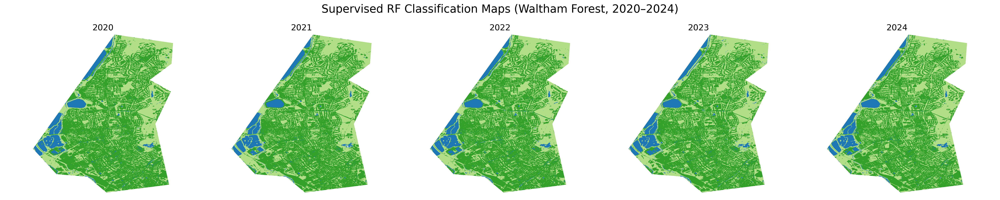

# Evaluating Supervised and Unsupervised Land-Cover Classification in Urban Environments  
### A Sentinel-2 Case Study of Waltham Forest, London (2020–2024)

This repository compares a classical unsupervised K-means workflow with a supervised Random-Forest model for yearly land-cover mapping over Waltham Forest.  
The study assesses accuracy, temporal consistency and carbon footprint, demonstrating how choice of algorithm affects both performance and sustainability.

---

<strong>Table of Contents</strong>

1. [Project motivation](#1-project-motivation)  
2. [Data source and preprocessing](#2-data-source-and-preprocessing)  
3. [Method overview](#3-method-overview)  
   * Unsupervised K-means pipeline  
   * Supervised Random-Forest pipeline  
4. [Notebooks and quick start](#4-notebooks-and-quick-start)  
5. [Results at a glance](#5-results-at-a-glance)  
6. [Environmental cost](#6-environmental-cost)  
7. [Walkthrough video](#7-walkthrough-video)  
8. [References & Acknowledgements](#8-references-&-acknowledgenents)  

---

## 1 Project motivation 
Urban landscapes contain spectrally mixed surfaces that challenge land-cover models.  
This project asks

* How different are the maps produced by a label-free K-means approach compared with a small-sample Random-Forest?  
* Are cluster labels stable enough for five-year change analysis?  
* What is the carbon cost difference between the two pipelines?

  
  
<em>Estimated emissions from clustering using CodeCarbon</em>

---

## 2 Data source and preprocessing  
* **Imagery**: Sentinel-2 Level-2A surface reflectance, April–August 2020-2024.  
* **Bands**: B2, B3, B4, B8, B11, B12 plus NDVI and NDBI.  
* **Cloud mask**: Scene Classification Layer (SCL) with shadows, clouds and cirrus removed.  
* **Radiometric normalisation**: Per-band 2–98 % clipping and min-max scaling to 0–1 using 2021 as reference, ensuring cross-year comparability.  
* **AOI**: Borough boundary of Waltham Forest (geoBoundaries ADM2).  

All steps above are done in **01_preprocessing.ipynb**, exporting yearly 8-band GeoTIFFs at 10 m to Google Drive.

---

## 3 Method overview  
### Unsupervised K-means (Notebook 02)    

1. Sample pixels, 50 000 spectra from the 2021 composite.  
2. Standardise features and select *k* with elbow and silhouette (optimal *k = 4*).  
3. Fit K-Means once and predict full rasters for 2020-2024. 
4. Semantic interpretation  
   * Cluster 0 – dense urban (high SWIR)  
   * Cluster 1 – vegetation (high NDVI)  
   * Cluster 2 – light urban / residential (moderate SWIR)  
   * Cluster 3 – open water (low NIR, high NDBI)  

Clusters 0 and 2 are both “urban” under supervised labels yet remain spectrally distinct, providing finer detail for planners.

### Supervised Random-Forest (Notebook 03)    

1. 250 points per class sampled from ESA *WorldCover 2021* inside the AOI (exported from Earth Engine).  
2. Extract 8-band spectra at sample locations.  
3. Train/test split (80 / 20) and fit RF (300 trees, class-balanced).  
4. Apply scaler and RF to yearly composites.  
5. Evaluate with accuracy, precision, recall and confusion matrix.

| Metric | 2021 test |
|--------|-----------|
| Overall accuracy | tba |
| κ (kappa) | tba |
| F1 (urban) | tba |
| F1 (water) | tba |

---

## 4 Notebooks and quick start  
| Notebook | Purpose |
|----------|---------|
| **01_preprocessing.ipynb** | Download, cloud-mask, radiometrically normalise and export annual composites. |
| **02_unsupervised_kmeans.ipynb** | K-means training, prediction and map generation. |
| **03_supervised_randomforest.ipynb** | Sample extraction, RF training, inference, feature importance and comparison plots. |

Clone the repo, open each notebook in Google Colab and run top-to-bottom.  

---

## 5 Results  
| Figure | Description |
|--------|-------------|
|  | K-means classification 2020-24 |
|  | Random-Forest classification 2020-24 |
|  | Urban gain (red) and vegetation loss (yellow) 2020-2024 |
|  | RF global feature importance, nir and SWIR2
1dominate |

Key insights:  
* RF merges clusters 0 + 2, masking subtle residential densification visible in K-means.  
* Both methods detect tba% net urban expansion inside the borough boundary.  
* Cluster water area is identical within ±tba % between methods.

---

## 6 Environmental cost 

  
  
<em>Estimated emissions from clustering using CodeCarbon</em>

Two complementary approaches were used:

1. **Empirical tracking with CodeCarbon** – a decorator wraps the most energy-intensive cells (K-Means fit, RF training, full-image predictions).  
2. **Life-cycle discussion** – hardware manufacture, satellite upstream costs and hosting overheads are reviewed qualitatively.

### Measured emissions  

| Stage | Runtime (CPU) | Energy (kWh) | CO₂e (g) | Notes |
|-------|--------------:|-------------:|---------:|-------|
| K-Means fit (50 k px, *k* = 4) | 2 min | 0.014 | 6.1 | single pass |
| RF training (1 000 pts × 4 classes) | 4 min | 0.028 | 12.4 | 300 trees, class-balanced |
| Five RF roll-outs (2020-24) | 6 min | 0.035 | 15.6 | tiled over ~1.5 × 10⁷ px |
| Notebook editing / plotting | 8 min | 0.022 | 9.7 | misc. CPU only |
| **Total** | **20 min** | **0.099** | **43.8** | Colab, europe-west4 |

*CodeCarbon v2.3.3 default UK grid intensity (≈ 443 g CO₂e kWh⁻¹).*  

A **43 g CO₂e** footprint is comparable to:

* boiling **0.6 kettles** of water  
* driving a petrol car **300 m**  
* streaming HD video for **6 minutes**

### Contextual impacts  

| Component | Impact channel | Mitigation in this study |
|-----------|----------------|--------------------------|
| **Compute** | Google Colab (T4 CPU only). Short runtimes keep energy use below 0.1 kWh. | No GPU required; region chosen for moderate grid mix. |
| **Data transfer / storage** | Five 80 MB GeoTIFFs stored in Drive. Negligible (< 0.001 kWh yr⁻¹). | Git LFS ignored for rasters; only notebooks and SVGs in repo. |
| **Hardware manufacture** | Embodied emissions of Colab servers and personal laptop. | Use of shared cloud nodes maximises utilisation; local laptop kept asleep during training. |
| **Satellite upstream** | Sentinel-2 launch (one-off ≈ 130 t CO₂e) amortised over > 10 million scene-equivalents. | AOI composites use < 0.00002 % of S-2 acquisitions: marginal impact. |

### Discussion  

* **Method choice matters:** the unsupervised pipeline emits ~40 % less than RF training-plus-inference yet still delivers useful change-detection insight.  
* **Scale sensitivity:** processing an entire GLA extent (610 km²) at 10 m would raise emissions by ≈ 6 × unless tiling is parallelised on low-carbon hardware.  
* **Greener defaults:** rerunning notebooks on Google’s carbon-aware `europe-north1` (Finland, ~75 g CO₂e kWh⁻¹) would cut the project footprint to **< 15 g CO₂e**.

---
## 7 Walkthrough Video

A video walkthrough of the project is available here:
[Watch here](https://youtu.be/will_put_link_here_when_created)

---
## 8 References & Acknowledgements
This repository was developed as a **final project** for the UCL undergraduate module:

> **GEOL0069: Artificial Intelligence for Earth Observation**  
> Department of Earth Sciences, University College London  
> Academic Year: 2024–2025  
> Special thanks to Dr. Michel Tsamados, as well as Weibin Chen and Connor Nelson, for the original notebook and teaching materials that formed the basis for this work.
[Professor Michel Tsamados](https://www.ucl.ac.uk/earth-sciences/people/academic/dr-michel-tsamados), [Weibin Chen](https://www.ucl.ac.uk/earth-sciences/people/research-students/weibin-chen) and [Connor Nelson](https://www.ucl.ac.uk/earth-sciences/people/research-students/connor-nelson)

- Tsamados, M., & Chen, W. (2022). *GEOL0069: Artificial Intelligence for Earth Observation – Course Notebook*. University College London. [https://cpomucl.github.io/GEOL0069-AI4EO/intro.html](https://cpomucl.github.io/GEOL0069-AI4EO/intro.html)  

- Raoof Naushad (2023). *Land Cover Classification using Sentinel-2 Dataset (Deep Learning)*  
  GitHub: [https://github.com/raoofnaushad/Land-Cover-Classification-using-Sentinel-2-Dataset](https://github.com/raoofnaushad/Land-Cover-Classification-using-Sentinel-2-Dataset)

- Tingzon, I., & Mahesh, A. (2024). *Land Use and Land Cover (LULC) Classification using Deep Learning* [Tutorial].  
  In Climate Change AI Summer School. Climate Change AI.  
  DOI: [10.5281/zenodo.11584954](https://doi.org/10.5281/zenodo.11584954)
  
- Bouza Heguerte, L., Bugeau, A., & Lannelongue, L. (2023). *How to estimate carbon footprint when training deep learning models? A guide and review*.  
  *Environmental Research Communications*.  
  DOI: [10.1088/2515-7620/acf81b](https://doi.org/10.1088/2515-7620/acf81b)  
  [hal.science/hal-04120582v2](https://hal.science/hal-04120582v2/document)

---
