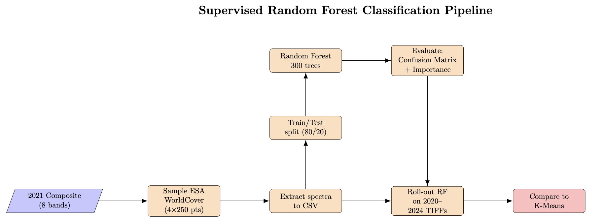

# Evaluating Supervised and Unsupervised Land-Cover Classification in Urban Environments  
### A Sentinel-2 Case Study of Waltham Forest, London (2020–2024)

This project compares an unsupervised K-means clustering workflow with a supervised Random Forest model for annual land-cover mapping over Waltham Forest. 
The study assesses accuracy, temporal consistency and carbon footprint, demonstrating how choice of algorithm affects both performance and sustainability.

---

<strong>Table of Contents</strong>

1. [Project Motivation and Background](#1--project-motivation-and-background)  
2. [Data Source and Pre-processing](#2--data-source-and-pre-processing)  
3. [Method Overview](#3--method-overview)  
   * [3.1 Unsupervised K-Means](#31--unsupervised-k-means)  
   * [3.2 Supervised Random Forest](#32--supervised-random-forest)  
4. [Notebooks and Quick Start](#4--notebooks-and-quick-start)  
5. [Results](#5--results)  
6. [Environmental Cost](#6--environmental-cost)  
7. [Walk-through Video](#7--walk-through-video)  
8. [References & Acknowledgements](#8--references--acknowledgements)

---

## 1  Project Motivation and Background
Urban environments present some of the most spectrally complex scenes in satellite imagery. Buildings, roads, vegetation, water and bare surfaces are frequently inter-mingled at the pixel level, making automated land-cover classification in cities a persistent challenge (Weng, 2012). The ability to monitor urban form and change over time is increasingly vital for climate adaptation, infrastructure planning and environmental monitoring (UN-Habitat, 2020).

Traditionally, supervised machine-learning approaches such as **Random Forests** rely on labelled training samples to learn class distinctions. However, acquiring high-quality labelled data is time-consuming and subjective, especially in heterogeneous urban areas where semantic boundaries are often unclear. **Unsupervised methods** such as **K-means clustering** offer a complementary alternative, grouping pixels solely on spectral similarity. While typically less interpretable, they may detect subtle patterns or transitions missed by supervised models.

This project explores both approaches by applying a Random Forest and an unsupervised K-means algorithm to five years of Sentinel-2 imagery over the Borough of Waltham Forest in north-east London. It compares not only classification accuracy and spatial patterns, but also temporal consistency and environmental cost. In doing so, the project asks:

> *How do supervised and unsupervised methods differ in their representation of urban land cover, and can clustering provide a more flexible, low-emission alternative in data-scarce settings?*

  
  
<em>Figure&nbsp;1 Study area – the London Borough of Waltham Forest.</em>

---

## 2  Data Source and Pre-processing
This project uses **Sentinel-2 Level-2A surface-reflectance imagery** (Copernicus Open Access Hub) to generate annual composites for land-cover classification.

| Step | Detail |
|------|--------|
| **Time window** | April–August each year (2020–2024) – peak “leaf-on” season improves spectral contrast. |
| **Spectral bands** | B2 (Blue), B3 (Green), B4 (Red), B8 (NIR), B11 (SWIR1), B12 (SWIR2) plus derived **NDVI** and **NDBI**. |
| **Cloud & shadow masking** | Sentinel-2 Scene Classification Layer (SCL) used to exclude clouds, cirrus and their shadows. |
| **Radiometric normalisation** | Pixel values clipped to the 2nd–98th percentile and scaled to \[0, 1] using 2021 as the reference year. |
| **Area of interest** | Administrative boundary for Waltham Forest (geoBoundaries ADM2). |

All processing steps are executed in  **`01_preprocessing.ipynb`**, exporting yearly 8-band 10 m GeoTIFFs to Google Drive.

---

## 3  Method Overview
Both models share the pre-processing pipeline described above and then diverge as follows.

### 3.1  Unsupervised K-Means

  
  
<em>Figure&nbsp;2 K-means clustering workflow (see <code>02_unsupervised_kmeans.ipynb</code>).</em>

* **Sample & scale** 50 000 pixels from the 2021 composite are scaled (StandardScaler).  
* **Cluster selection** *k* = 4 chosen via elbow and silhouette scores.  
* **Semantic interpretation** Clusters are post-labelled as 
  0 Urban (roads/residential)  
  1 Vegetation  
  2 Industrial/Light roofs  
  3 Open water

  
  
<em>Figure&nbsp;3 Conceptual diagram of K-means clustering.</em>

### 3.2  Supervised Random Forest

  
  
<em>Figure&nbsp;4 Random-Forest workflow (see <code>03_supervised_randomforest.ipynb</code>).</em>

* **Training data** 250 points × 4 classes from **ESA WorldCover 2021**.  
* **Model** 300-tree Random Forest, 80/20 train–test split, class-balanced.  
* **Feature importance** Computed with SHAP.  
* **Performance on 2021 hold-out set**

  | Metric | Score |
  |--------|------:|
  | Overall accuracy | 0.81 |
  | Cohen’s κ | 0.72 |
  | F1 (urban) | 0.77 |
  | F1 (water) | 0.93 |

Random Forest offers robust classification performance, particularly for stable land types like water. However it tends to merge spectrally distinct urban subclasses that K-means keeps separate.

---

## 4  Notebooks and Quick Start
| Notebook | Purpose |
|----------|---------|
| **`01_preprocessing.ipynb`** | Download and prepare Sentinel-2 composites. |
| **`02_unsupervised_kmeans.ipynb`** | Fit and apply K-means model. |
| **`03_supervised_randomforest.ipynb`** | Train Random Forest, run inference and compare results. |

> **Quick start** Clone the repo, open each notebook in Google Colab and run top-to-bottom. No local installs required.

---

## 5  Results
<table>
<tr><th style="text-align:center">Figure</th><th>Description</th></tr>
<tr>
<td></td>
<td><strong>Figure 5.</strong> K-means classifications (2020 → 2024), shown as an animated GIF to illustrate year-on-year change.</td>
</tr>
<tr>
<td></td>
<td><strong>Figure 6.</strong> Random-Forest classifications (2020 → 2024), shown as an animated GIF to illustrate year-on-year change.</td>
</tr>
<tr>
<td></td>
<td><strong>Figure 7.</strong> Urban gain (red) and vegetation loss (yellow), 2020–2024. RF detects more change due to its sensitivity to subtle spectral shifts; K-means is more conservative and stable in its outputs.</td>
</tr>
<tr>
<td></td>
<td><strong>Figure 8.</strong> Feature importance from the Random Forest model. NIR and SWIR2 dominate.</td>
</tr>

</table>

### 5.1  Land-Cover Area Comparison (2024)

| Class | Random Forest (%) | K-means (%) | Comment |
|-------|------------------:|------------:|---------|
| Urban | 39.43 | 48.48 | RF underestimates urban compared to K-means |
| Industrial | 0.00 | 6.16 | RF merges this into general urban, K-Means separates it |
| Vegetation | 53.65 | 39.39 | RF likely over-assigns vegetated pixels |
| Water | 6.92 | 5.97 | High agreement between methods |

#### 5.2  Key Insights and Observations
* **Urban spectral sub-types** K-means reveals an additional cluster, industrial/light-roofed buildings (e.g., schools, depots), missed by RF. These have distinct spectral traits (low NIR, high SWIR), adding structural detail without semantic labels. RF provides clearer classes but may overlook such intra-urban variation.
* **Vegetation assignment differs** RF maps more vegetation, likely due to its sensitivity to NDVI-rich mixed pixels in semi-urban areas. K-means is stricter, reducing overclassification but risking omission of shaded or sparse vegetation.
* **Hydrological stability** Both models show <2 % variation in open-water extent.  
* **Change-detection divergence** RF shows a +14.1 % increase in urban area, while K-means suggests a −7.8 % decrease. The RF model, trained on static labels, offers consistency in class definitions but is sensitive at the pixel level, producing more visible red/yellow noise in the change map (Fig. 7). K-means, meanwhile, yields smoother maps but greater year-on-year variation in total class areas, due to its sensitivity to spectral drift and threshold shifts. This illustrates a trade-off: RF is more stable categorically, K-means spectrally.

#### 5.3  Limitations
* **Label dependence (RF)** Sub-classes are collapsed to the labels present in ESA WorldCover.  
* **Cluster interpretation (K-means)** Requires manual labelling post hoc; risk of mis-classifying transitional pixels.  
* **Temporal stability** Because centroids were based on 2021 data, K-means shows more year-to-year variation. RF, trained on labels from each year, offers more stable temporal comparisons.
* **Subjectivity of “urban”** Definitions of “urban” vary. Rooftops, roads, bare soil, and even carparks may be included or excluded depending on the method. This project doesn’t solve that ambiguity, but visual side-by-sides help reveal what each model is actually capturing.

---

## 6  Environmental Cost
This project incorporates environmental accountability by tracking the computational energy usage and estimated carbon emissions associated with each stage of the workflow. While the emissions are minimal in absolute terms, the broader goal is to cultivate sustainable habits in spatial computing and remote sensing research.

| Stage           | Runtime (hrs) | Energy (kWh) |  CO₂e (g) |    Cost (£) | Notes                   |
| --------------- | ------------: | -----------: | --------: | ----------: | ----------------------- |
| Preprocessing   |        0.0280 |     0.000560 |     0.131 |      0.0002 | GEE export + rescaling  |
| K-Means (k = 4) |        0.1145 |     0.002289 |     0.533 |      0.0007 | Cluster fit + inference |
| Random Forest   |        0.0646 |     0.001292 |     0.301 |      0.0004 | Train, predict, compare |
| **Total**       |    **0.2071** | **0.004141** | **0.965** | **£0.0013** | All stages, CPU only    |

*Assumptions: 20 W CPU, 0.233 kg CO₂/kWh (UK grid), £0.30/kWh.*

At just under **1 g CO₂e**, the entire analysis emitted less than:

- 1 minute of HD video streaming
- Boiling ⅒ of a kettle
- Driving ~5 meters in a petrol car

#### 6.1  Context and Mitigation  
* **Efficient compute:**  Executed on CPU-only Google Colab sessions (<12 min), using carbon-neutral infrastructure with no GPU or fine-tuning.

* **Minimal data load:**  Used only a tiny fraction (<0.00002%) of Sentinel-2’s total capacity, whose emissions are amortised globally, plus no heavy raster storage or repeated compute.

* **Code efficiency:**  Modular, single-pass pipelines avoided redundancy, and reusable notebooks reduce future re-runs.

* **Scalability concerns:**  Expanding to a full metro area (e.g., Greater London) could multiply emissions ~6×. Choosing carbon-aware Colab region using carbon-aware Colab Pro (e.g., `europe-north1`, `us-west1`) can reduce emissions by up to 80%.

* **Low-carbon modelling choices:** Unsupervised methods like K-Means offer lower-carbon alternatives in scenarios where labelled data is unavailable or overfitting is a risk.

Ultimately, while this project’s carbon footprint is scientifically negligible, its carbon accounting reflects a responsible approach to computational geography. As machine learning expands in environmental domains, even small efficiencies can add up to meaningful impact.

---

## 7  Walk-through Video
A short walk-through (8 min) covering data, code and results is available on YouTube:  
**<https://youtu.be/will_put_link_here_when_created>**

---

## 8  References & Acknowledgements
This repository was developed as a final project for the UCL undergraduate module **GEOL0069 Artificial Intelligence for Earth Observation**.  
Special thanks to **Dr Michel Tsamados**, **Weibin Chen** and **Connor Nelson** for the original notebooks and teaching materials that formed the basis for this work.

### 8.1  Reference List 
* Bouza Heguerte, L., Bugeau, A. and Lannelongue, L. (2023) ‘How to estimate carbon footprint when training deep learning models? A guide and review’, *Environmental Research Communications*. Available at: <https://doi.org/10.1088/2515-7620/acf81b>   
* Google (2024) *2024 Environmental Report*. Available at: <https://blog.google/outreach-initiatives/sustainability/2024-environmental-report/>   
* Google (n.d.) *Innovating sustainable ideas, growing renewable solutions*. Available at: <https://datacenters.google/operating-sustainably/> 
* Medium (2024) ‘Understanding how K-means clustering works – a detailed guide’. Available at: <https://levelup.gitconnected.com/understanding-how-k-means-clustering-works-a-detailed-guide-9a2f8009a279>  
* Naushad, R. (2023) *Land-cover classification using Sentinel-2 dataset (deep learning)*. GitHub. Available at: <https://github.com/raoofnaushad/Land-Cover-Classification-using-Sentinel-2-Dataset>  
* Strubell, E., Ganesh, A. and McCallum, A. (2020) ‘Energy and policy considerations for modern deep learning research’, *Proceedings of the AAAI Conference on Artificial Intelligence* Available at: <https://doi.org/10.1609/aaai.v34i09.7123> (Accessed 8 June 2025).  
* Tingzon, I. and Mahesh, A. (2024) *Land-use and land-cover classification using deep learning* (Tutorial). Climate Change AI Summer School. Available at: <https://doi.org/10.5281/zenodo.11584954> 
* Tsamados, M. and Chen, W. (2022) *GEOL0069: Artificial Intelligence for Earth Observation – course notebook*. University College London. Available at: <https://cpomucl.github.io/GEOL0069-AI4EO/intro.html> 
* UN-Habitat (2020) *World Cities Report 2020: The value of sustainable urbanisation*. United Nations Human Settlements Programme. Available at: <https://unhabitat.org/sites/default/files/2020/10/wcr_2020_report.pdf> (Accessed 8 June 2025).  
* Weng, Q. (2012) ‘Remote sensing of impervious surfaces in urban areas: Requirements, methods and trends’, *Remote Sensing of Environment* Available at: <https://doi.org/10.1016/j.rse.2011.02.030> 

---
